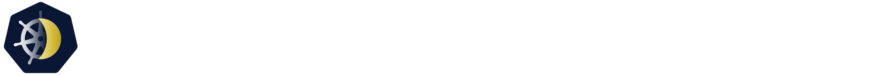

<!-- markdownlint-disable line-length -->

<a target="_blank" href="/../../releases/" title="GitHub Release"></a>
<a target="_blank" href="./LICENSE" title="GitHub License"></a>
<a target="_blank" href="/../../graphs/contributors" title="Contributors"></a>
<a target="_blank" href="/../../stargazers" title="Stars"></a>
<a target="_blank" href="https://inviter.co/kube-downscaler" title="Slack Workspace"></a>

<!-- markdownlint-enable line-length -->

A horizontal autoscaler for Kubernetes workloads.
This is a golang port and successor of the popular [(py-)kube-downscaler](https://github.com/caas-team/py-kube-downscaler)
with improvements and quality of life changes.

## Documentation and Guides

The documentation and guides can be found on [our website](https://caas-team.github.io/GoKubeDownscaler).

An offline copy of the documentation and blogs can be found in [`website/content`](./website/content) and [`website/blog`](./website/blog).
In there are Markdown files which can be viewed in any text editor or inside of a Markdown Viewer.

## Installation

Installation is done via the [Helm Chart](./deployments/chart/).
Information on how to install the Downscaler is on [our website](https://caas-team.github.io/GoKubeDownscaler/guides/getting-started/installation).

### Missing Features

GoKubeDownscaler is now GA.
This means that the core py-kube-downscaler features are all present, though there’s a small chance we might have missed something
You can find a list of the known-missing features [under the `missing feature` label](/../../labels/missing%20feature).
If you think that any other features are missing, or you have an idea for a new feature, feel free to open an [Issue](/../../issues/).

## Developing

This section covers the basics of developing on this repo, a more detailed guide can be found on [our website](https://caas-team.github.io/GoKubeDownscaler/contributing/developing).

Please read the [contribution manifest](./CONTRIBUTING.md).

### Cloning the Repository

```bash
git clone https://github.com/caas-team/GoKubeDownscaler.git
cd GoKubeDownscaler
```

### Setting up Pre-Commit

```bash
brew install pre-commit
pre-commit install
brew install golangci-lint
brew install gofumpt
```

### Testing the Downscaler

#### Running the Unit Tests

```bash
go test -v --cover ./...
```

#### Running the Downscaler Locally

The downscaler can be run locally by specifying a kubeconfig to use.
The kubeconfig should have at least the permissions as the Helm Charts [role.yaml](./deployments/chart/templates/role.yaml).
The downscaler will use the current-context in the kubeconfig.

```bash
go run -k=path/to/kubeconfig # ... additional configuration
```

### Testing the Website

#### Installing Dependencies

```bash
npm install --prefix website
```

#### Running It Locally

```bash
npm run --prefix website start
```

after that the website is available on `localhost:3000/GoKubeDownscaler`
