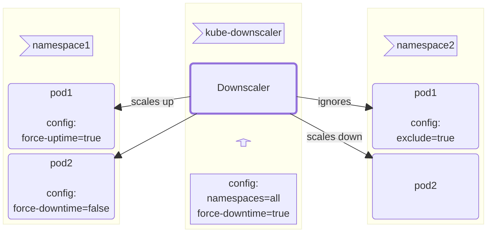
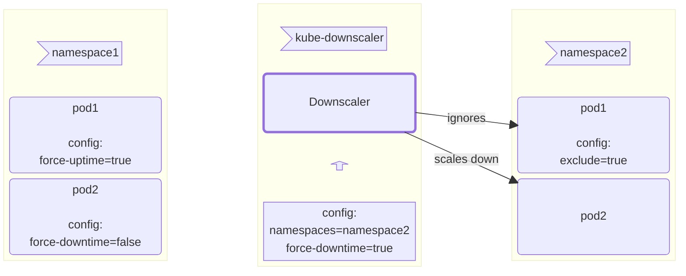

# Introduction

GoKubeDownscaler is a custom Kubernetes controller designed to significantly reduce cloud infrastructure costs by
automatically scaling non-essential workloads down to zero outside working or service hours.

## How It Works

### Set Up Time Windows And Target Workloads

Start by defining specific time windows for the workloads that should be scaled down outside working or service hours.
You can configure these time windows at the following levels:

- **Cluster Wide:** Apply a global time window for the entire cluster,
  ensuring all targeted workloads are scaled down during the specified period.
  Cluster-wide configuration is applied using regex.
- **Namespace/Workload:** Set up time windows for individual namespaces or specific workloads for more granular control over the scaling behavior.
  This configuration is applied using annotations.

These levels can be combined for greater flexibility.
When time windows are defined at both the cluster and namespace/workload levels,
the more granular configuration (namespace/workload) will take precedence, offering precise control over when and how workloads scale down.

Additionally, **exclusions can be applied with the same level of granularity**,
allowing specific workloads or namespaces to be excluded from scaling rules as needed.

### Scale Automatically

- The controller continuously monitors the defined time windows and targets,
  automatically scaling down workloads during the specified periods.
- It also scales them back up to their original state once the time window ends,
  ensuring that workloads are available when needed.

### Save On Your Cloud Bills

- As workloads scale down, cluster nodes, which are a major cost factor in cloud infrastructure,
  are also automatically scaled down, reducing your cloud bill.

## When To Use GoKubeDownscaler

GoKubeDownscaler is ideal for scenarios where workloads are not required during certain periods.
Here are some use cases where it can be adopted:

- **Outside Company Working Hours:**
  Automatically scale down non-essential workloads during evenings, weekends,
  or after office hours to reduce costs when demand is low.
- **Holidays:**
  Scale down workloads during company holidays such as Christmas, Easter, or bank holidays when activity is minimal.
- **Development and Testing Environments:**
  Scale down non-essential development or testing workloads during periods of low usage,
  such as overnight, lunch breaks, or between development sprints.
- **Production Environments:**
  For production environments that need to be available only during certain hours

## Installation And Architecture

GoKubeDownscaler can be installed in two modes, each with its own architecture.
The installation mode depends on the permissions of the user deploying the tool,
but both modes leverage the same scaling logic, offering flexibility and security based on available privileges.

### Cluster-Wide Mode

The Cluster-Wide mode requires cluster-level administrator permissions,
installs the tool as a centralized component, and allows management of workloads across all namespaces.
This mode is ideal for scenarios where an administrator wants to apply downscaling policies to the entire cluster.

### Namespace-Scoped Mode

The Namespace-Scoped mode does not require administrative permissions on the entire cluster.
Instead, the tool is installed with limited permissions specific to certain namespaces,
making it perfect for teams or users with restricted access.
It allows control over resources within their designated namespace.
You can set which namespaces the GoKubeDownscaler is restricted to
with the [constrainedNamespaces](ref:docs-helm-constrained-namespaces) field in the [values.yaml](repo:deployments/chart/values.yaml) file.

The installation process can be performed using Helm, check the [installation guide](ref:docs-helm)
for more details.
