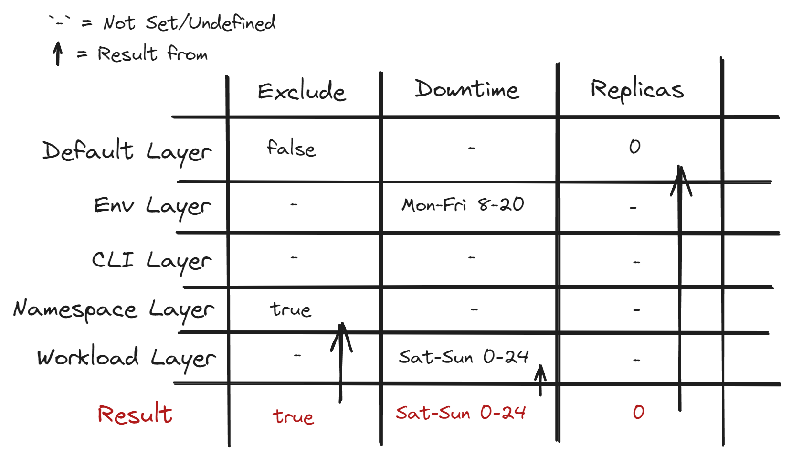

# Layers

Layers are layers of [values](ref:docs-values).
They define a uniform way of how to select which of the values gets used.

## How It Works

The resulting value is always the one set by the most specific layer that has set that value.

This means [Workload Layer](#workload-layer) > [Namespace Layer](#namespace-layer) >
[CLI Layer](#cli-layer) > [ENV Layer](#environment-layer) > [Default Layer](#default-layer).

### Value Groups

Some [values](ref:docs-values) within one layer set/define very similar properties (e.g. [Force Downtime](ref:docs-values#force-downtime)
and [Force Uptime](ref:docs-values#force-uptime); [Downscale Period](ref:docs-values#downscale-period),
[Downtime](ref:docs-values#downtime), [Upscale Period](ref:docs-values#upscale-period) and [Uptime](ref:docs-values#uptime))

These values are not all handled separately when choosing which layer to take the values from.
Instead if one of them is set in a layer, the other values will be taken from the same layer.

Incompatibilities between values normally only occur between values in the same value group and therefore the values on that same layer.

## Workload Layer

Defined by the [annotations](ref:docs-values) on the [workload](ref:docs-workload-types) every scan.

The most specific layer.
If a value gets set here it will be used for scaling.

## Namespace Layer

Defined by the [annotations](ref:docs-values) on the namespace every scan.

Values set here can be overwritten by the [workload layer](#workload-layer)

## CLI Layer

Defined by the [cli arguments](ref:docs-arguments) at startup.

Values set here can be overwritten by the [namespace](#namespace-layer) and [workload layer](#workload-layer)

## Environment Layer

Defined by the [environment variables](ref:docs-environment-variables) at startup.

Values set here can be overwritten by the [cli](#cli-layer), the [namespace](#namespace-layer) and [workload layer](#workload-layer).

:::info

With the current setup it is not possible to update these values every scan,
as the value of config maps is only passed in at creation of the deployment.

:::

## Default Layer

Holds the defaults for all [values](ref:docs-values).

Values set here can be overwritten by all other layers.
